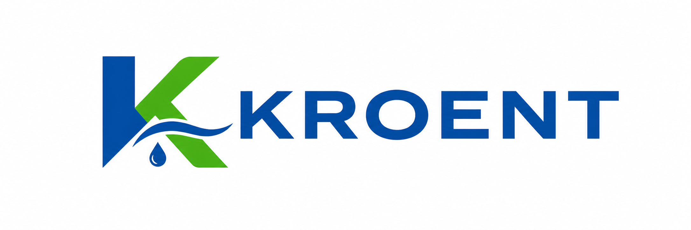

# KROENT

## Industrial Filtration & Separation Solutions

Process Filtration • Process Separation • Water Treatment

Technology-driven provider of industrial filtration and separation solutions for process industries, advanced manufacturing, energy infrastructure and environmental applications.

---

## Quick Navigation

- [Filtration Basics](#filtration-basics)

- [Serving Industries](#serving-industries)

- [Industry Applications](#industry-applications)

- [Products](#products)

- [Wiki](#wiki)

- [FAQ](#faq)
  
- [Knowledge Center](#knowledge-center)

- [Contact](#contact)

- [Follow Us](#follow-us)

---

# Filtration Basics

### What Is Microfiltration (MF)?

### What Is Ultrafiltration (UF)?

### What Is Nanofiltration (NF)?

### What Is Depth Filtration?

### MF vs UF

---

# Serving Industries

- Pharmaceutical

- Electronics & Semiconductor

- Chemical & Petrochemical

- Food & Beverage

- Energy Storage

- AI Data Centers

- Heavy Industries

- Environmental Services

---

# Industry Applications

### Pharmaceutical Filtration

### Electronics & Semiconductor Filtration

### Chemical & Petrochemical Filtration

### Food & Beverage Processing

### Water Treatment Solutions

### High Purity Water Applications

### Energy Storage Liquid Cooling Filtration

### AI Data Center Liquid Cooling Filtration

### Industrial Air & Gas Filtration

### Heavy Industry Applications

---

# Products

### Filter Cartridges

### Filter Bags

### Filter Housings

### Membrane Elements

### Ion Exchange Resins

### Filtration Systems

---

# Wiki

Explore our technical knowledge base.

➡️ [Visit Wiki](https://github.com/KroentOfficial/Kroent/wiki)

---

# Knowledge Center

### Industrial Filtration Fundamentals

### Filter Bags

### Filter Cartridges 

### Depth Filtration

### Membrane Technologies

### Microfiltration (MF)

### Ultrafiltration (UF)

### Nanofiltration (NF)

### Reverse Osmosis (RO)

### Process Separation

### Water Treatment

### High Purity Water

### Liquid Cooling Filtration

### Energy Storage Applications

### AI Data Center Applications

---

# FAQ

Frequently asked questions and technical resources.

➡️ [Visit Wiki FAQ](https://github.com/KroentOfficial/Kroent/wiki/FAQ)

---

## Contact

📧 [hello@kroent.com](mailto:hello@kroent.com) | 💬 [WhatsApp](https://wa.me/85244147292) | 🌐 [Website](https://www.kroent.com)

---

## Follow Us

📰 [Medium](https://medium.com/@Kroent) | 📘 [Facebook](https://www.facebook.com/Kroent) | 📌 [Pinterest](https://www.pinterest.com/Kroentofficial) | 𝕏 [X](https://x.com/KroentOfficial)

